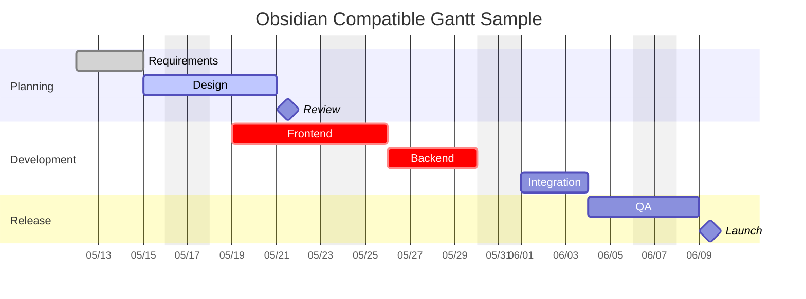

# Obsidian Mermaid Gantt Sample

이 파일은 Obsidian에서 바로 미리보기 되도록, 비교적 보수적인 Mermaid `gantt` 문법만 사용한 샘플입니다.

미리보기가 안 보이면 노트를 `Reading view` 또는 `Live Preview`로 전환해서 확인하세요.



추가 확인 포인트:

- 코드 펜스는 반드시 ```` ```mermaid ```` 형식이어야 합니다.
- 편집기의 `Source mode`에서는 다이어그램 대신 코드 블록만 보일 수 있습니다.
- Obsidian은 내장 Mermaid 버전을 사용하므로, Mermaid 공식 최신 문서의 일부 문법은 바로 동작하지 않을 수 있습니다.
