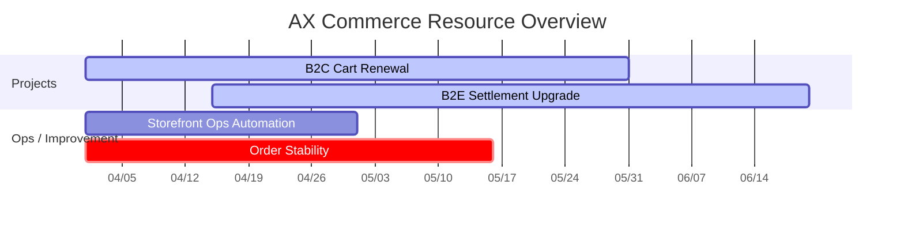

# Executive Overview

## 현재 상태

| 구분 | 진행 수 | 주의 필요 | 비고 |
|---|---:|---:|---|
| 프로젝트 | 3 | 1 | EPIC 기준 |
| 운영/개선 테마 | 5 | 2 | TASK 묶음 기준 |
| 과부하 인원 | 4 | - | 80% 초과 |
| 여유 인원 | 3 | - | 50% 이하 |

## 프로젝트 포트폴리오

| 프로젝트/업무 | 유형 | 주관 팀 | 기간 | 핵심 인력 | 상태 |
|---|---|---|---|---|---|
| B2C 장바구니 개편 | project | B2C개발 | 2026-04-01 ~ 2026-05-30 | 홍길동, 김영희 | 진행중 |
| B2E 복지몰 정산 개선 | project | B2E개발 | 2026-04-15 ~ 2026-06-20 | 박민수, 이수진 | 진행중 |
| 전시 운영 자동화 | ops | 커머스기획 | 2026-04-01 ~ 2026-04-30 | 최은지 | 진행중 |
| 주문/결제 안정화 | ops | B2C개발 | 2026-04-01 ~ 2026-05-15 | 정현우, 한지민 | 주의 |

## 팀별 가동률

| 팀 | 인원 | 평균 가동률 | 과부하 | 여유 |
|---|---:|---:|---:|---:|
| 커머스기획팀 | 8 | 72% | 1 | 1 |
| B2C커머스개발팀 | 10 | 84% | 3 | 1 |
| B2E커머스개발팀 | 5 | 68% | 0 | 1 |

## 리소스 배정 맵

## 배정 의사결정 규칙

- 신규 프로젝트는 평균 가동률 70% 이하 팀 우선 검토
- 개인 배정률 80% 초과 시 추가 업무 배정 금지
- 운영/개선 긴급 업무는 기존 프로젝트 인원 차출이 아니라 "여유 인원" 우선 배정
- 프로젝트 핵심 인력은 동시에 2개 이상 핵심 역할 금지
