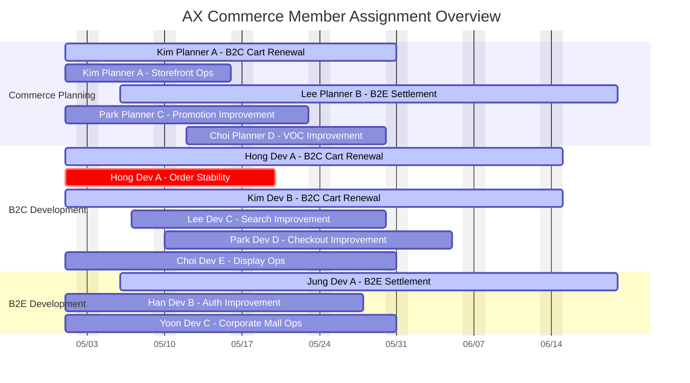

# Member Gantt Overview

전체 구성원의 업무 배정 현황을 구성원 순으로 보는 Gantt 차트는 충분히 가능하다.

다만 23명을 한 화면에 모두 넣을 때는 아래 원칙을 지켜야 읽을 수 있다.

- 한 사람당 최대 2~3개 업무만 노출
- 운영/개선 업무는 개별 TASK가 아니라 운영 테마로 묶기
- 기간은 월간 또는 6주 뷰로 제한
- 상태 색상만 단순히 사용하고, 상세 설명은 표로 분리

## 추천 사용 목적

- 지금 누가 무엇을 맡고 있는지 빠르게 확인
- 신규 업무를 어디에 배정할지 판단
- 특정 인원 과부하 여부 확인
- 팀 간 리소스 재배치 필요성 점검

## 추천 대시보드 구조

### 1. 임원용: 전체 구성원 Gantt 요약판

- 23명 전체를 표시
- 한 사람당 핵심 업무만 표시
- 기간은 당월 또는 향후 6주
- 목적: 전체 과부하/여유 확인

### 2. 팀장용: 팀별 상세 Gantt

- 커머스기획팀, B2C개발팀, B2E개발팀 각각 분리
- 개인별 세부 업무 2~4개 표시
- 목적: 실제 배정 조정

### 3. 운영용: 월간 배정 테이블

- 표 형태로 시작일/종료일/배정률/JIRA 키 확인
- 목적: Gantt에서 안 보이는 상세 확인

## 가장 권장하는 대시보드 조합

23명 규모에서는 아래 조합이 가장 실용적이다.

1. `executive_overview.md`
2. `member_gantt_overview.md`
3. 팀별 상세 Gantt 3개
4. 월간 배정 테이블 1개

즉, "한 장으로 다 해결"하려 하지 말고, 요약과 상세를 분리하는 것이 좋다.

## 전체 구성원 예시

## 함께 보는 표

Gantt만으로는 배정률이 잘 안 보이므로, 같은 문서에 요약 표를 붙이는 것이 좋다.

| 이름 | 팀 | 현재 핵심 업무 | 보조 업무 | 총 배정률 | 상태 |
|---|---|---|---|---:|---|
| 김기획A | 기획 | B2C 장바구니 개편 | 전시 운영 개선 | 80% | 주의 |
| 홍개발A | B2C개발 | B2C 장바구니 개편 | 주문 안정화 | 90% | 과부하 |
| 정개발A | B2E개발 | B2E 정산 개선 | - | 70% | 정상 |

## 권장 시각 규칙

- `active`: 현재 핵심 프로젝트
- `crit`: 과부하 유발 또는 일정 리스크가 큰 업무
- 일반 색상: 운영/개선 또는 보조 업무

색상은 Mermaid 기본 스타일을 쓰되, 지나치게 많은 상태를 만들지 않는 편이 낫다.

## 이 뷰의 한계

- Mermaid Gantt는 "배정률 크기"를 막대 두께로 표현하지 못한다
- 같은 사람의 동시 병행 업무가 많아지면 가독성이 급격히 떨어진다
- 23명 전체를 월 단위 이상으로 길게 보면 사실상 읽기 어렵다

그래서 다음 분리가 필요하다.

- 전체판: 1개월 또는 6주
- 팀별판: 최대 2개월
- 분기판: 사람 기준이 아니라 프로젝트 기준

## 결론

구성원 순 Gantt는 만들 수 있고, 임원 관점에서도 유용하다.

하지만 가장 좋은 대시보드는 "전체 구성원 1장짜리 단일판"이 아니라 아래와 같은 조합이다.

- 임원용 전체 구성원 Gantt 요약판
- 팀장용 팀별 상세 Gantt
- 월간 배정 테이블
- 분기 프로젝트 로드맵

이 조합이 한눈에 보이는 가시성과 실제 배정 운영성을 같이 확보한다.
