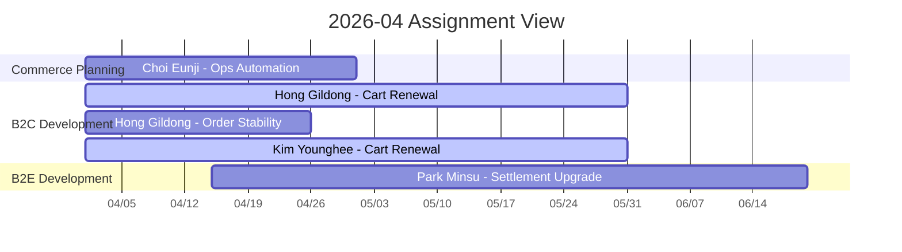

# 2026-04 Monthly Resource Board

## 월간 운영 규칙

- 이 파일은 실제 배정과 변경을 관리하는 기준 파일이다
- 프로젝트는 EPIC 기준, 운영/개선은 TASK 묶음 기준으로 기록한다
- 개인 총 배정률은 100%를 넘기지 않는다
- 80% 초과 인원은 `주의`로 표시한다

## 월간 배정 현황

| 이름 | 팀 | 업무명 | 유형 | JIRA | 시작 | 종료 | 배정률 | 상태 |
|---|---|---|---|---|---|---|---:|---|
| 홍길동 | B2C개발 | B2C 장바구니 개편 | project | EPIC-101 | 2026-04-01 | 2026-05-30 | 60% | 진행중 |
| 홍길동 | B2C개발 | 주문/결제 안정화 | ops | TASK-451 | 2026-04-01 | 2026-04-25 | 20% | 진행중 |
| 김영희 | B2C개발 | B2C 장바구니 개편 | project | EPIC-101 | 2026-04-01 | 2026-05-30 | 70% | 진행중 |
| 박민수 | B2E개발 | B2E 복지몰 정산 개선 | project | EPIC-204 | 2026-04-15 | 2026-06-20 | 50% | 진행중 |
| 최은지 | 기획 | 전시 운영 자동화 | ops | TASK-322 | 2026-04-01 | 2026-04-30 | 30% | 진행중 |

## 인원별 요약

| 이름 | 팀 | 프로젝트 배정 | 운영 배정 | 총 배정률 | 상태 |
|---|---|---:|---:|---:|---|
| 홍길동 | B2C개발 | 60% | 20% | 80% | 주의 |
| 김영희 | B2C개발 | 70% | 10% | 80% | 주의 |
| 박민수 | B2E개발 | 50% | 20% | 70% | 정상 |
| 최은지 | 기획 | 40% | 30% | 70% | 정상 |

## 월간 캘린더 뷰

## 변경 이력

| 날짜 | 변경 내용 | 반영자 |
|---|---|---|
| 2026-04-01 | 4월 초기 배정 등록 | 팀장 |
