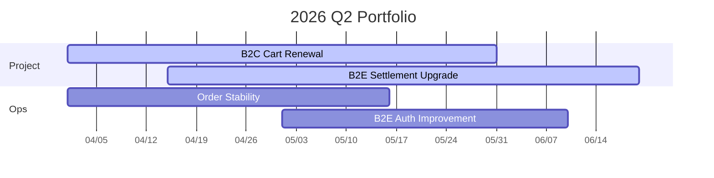

# 2026 Q2 Resource Plan

## 분기 핵심 과제

| 구분 | 이름 | JIRA | 기간 | 오너 | 참여 팀 | 상태 |
|---|---|---|---|---|---|---|
| project | B2C 장바구니 개편 | EPIC-101 | 2026-04-01 ~ 2026-05-30 | B2C개발팀 | 기획, B2C개발 | 진행중 |
| project | B2E 복지몰 정산 개선 | EPIC-204 | 2026-04-15 ~ 2026-06-20 | B2E개발팀 | 기획, B2E개발 | 진행중 |
| ops | 주문/결제 안정화 | TASK 묶음 | 2026-04-01 ~ 2026-05-15 | B2C개발팀 | B2C개발 | 진행중 |
| ops | 사내몰 권한 개선 | TASK 묶음 | 2026-05-01 ~ 2026-06-10 | B2E개발팀 | B2E개발 | 예정 |

## 분기 일정

## 팀별 주요 투입

| 팀 | 주요 업무 | 핵심 담당 | 평균 배정률 |
|---|---|---|---:|
| 커머스기획팀 | 요구사항 정의, 정책 조율, 운영 개선 | 팀 내 PM/PO | 70% |
| B2C개발팀 | B2C 프로젝트, 주문 안정화 | 개발 리드 | 84% |
| B2E개발팀 | 복지몰 정산, 권한 개선 | 개발 리드 | 68% |
